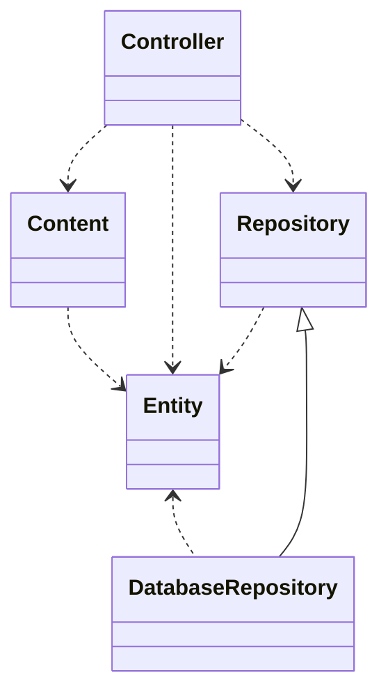
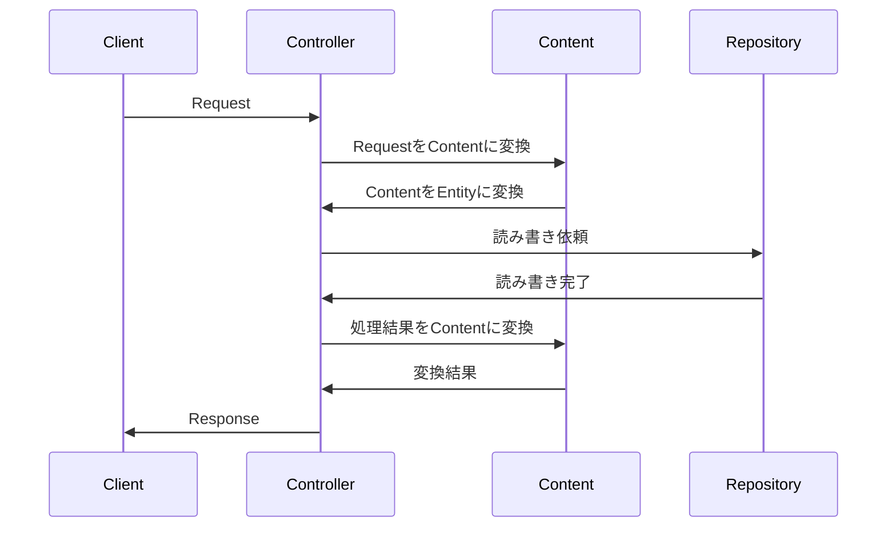

# アーキテクチャ

```mermaid
classDiagram

Controller ..> Content
Content ..> Entity
Controller ..> Entity
Controller ..> Repository
Repository..>Entity
Repository <|-- DatabaseRepository
Entity <.. DatabaseRepository
```

```mermaid
sequenceDiagram

participant Client
participant Controller
participant Content

Client->>Controller: Request
Controller->> Content: RequestをContentに変換
Content->>Controller: ContentをEntityに変換
Controller->>Repository: 読み書き依頼
Repository->>Controller: 読み書き完了
Controller->>Content: 処理結果をContentに変換
Content ->> Controller: 変換結果
Controller ->> Client: Response
```